# Mô hình Star Schema trên Snowflake — Student Sales

Mô hình được triển khai trong `STUDENT_SALES_DW.CORE`. Đây là một Star Schema mở rộng theo dạng fact constellation: `FACT_SALES` là fact trung tâm cho bán hàng, bên cạnh các fact riêng cho đơn hàng, thanh toán, trả hàng, đánh giá, vận chuyển, tồn kho và traffic.

## Phạm vi MVP

Gold layer sử dụng các nguồn Silver chuẩn chính: `customers`, `geography`, `products`, `promotions`, `orders_enriched`, `order_items`, `payments`, `returns`, `reviews`, `shipments`, `inventory` và `web_traffic`.

Các bảng `epd`, `eprom` và `tf` là biến thể của `products`, `promotions` và `web_traffic`. Chúng không được nạp vào Gold layer để tránh nhân đôi số liệu. Có thể bổ sung chúng như nguồn thay thế sau khi xác định rõ quy tắc hợp nhất.

## Grain

| Bảng fact | Grain |
| --- | --- |
| `fact_sales` | Một dòng nguồn trong `order_items` |
| `fact_orders` | Một đơn hàng |
| `fact_payments` | Một thanh toán cho một đơn hàng |
| `fact_returns` | Một sự kiện trả hàng |
| `fact_reviews` | Một đánh giá sản phẩm trong đơn hàng |
| `fact_shipments` | Một lần giao cho một đơn hàng |
| `fact_inventory_snapshot` | Một sản phẩm tại một ngày snapshot |
| `fact_web_traffic` | Một nguồn traffic tại một ngày |

## Star Schema

```mermaid
erDiagram
    DIM_DATE ||--o{ FACT_SALES : order_date
    DIM_CUSTOMER ||--o{ FACT_SALES : customer
    DIM_PRODUCT ||--o{ FACT_SALES : product
    DIM_GEOGRAPHY ||--o{ FACT_SALES : geography
    DIM_SALES_EMPLOYEE ||--o{ FACT_SALES : employee
    DIM_PROMOTION ||--o{ FACT_SALES : primary_promotion

    DIM_DATE ||--o{ FACT_ORDERS : order_date
    DIM_CUSTOMER ||--o{ FACT_ORDERS : customer
    DIM_GEOGRAPHY ||--o{ FACT_ORDERS : geography
    DIM_SALES_EMPLOYEE ||--o{ FACT_ORDERS : employee
    DIM_SHIPPER ||--o{ FACT_ORDERS : shipper

    DIM_DATE ||--o{ FACT_PAYMENTS : order_date
    DIM_CUSTOMER ||--o{ FACT_PAYMENTS : customer

    DIM_PRODUCT ||--o{ FACT_RETURNS : product
    DIM_CUSTOMER ||--o{ FACT_RETURNS : customer
    DIM_DATE ||--o{ FACT_RETURNS : return_date
    DIM_PRODUCT ||--o{ FACT_REVIEWS : product
    DIM_CUSTOMER ||--o{ FACT_REVIEWS : customer
    DIM_DATE ||--o{ FACT_REVIEWS : review_date

    DIM_SHIPPER ||--o{ FACT_SHIPMENTS : shipper
    DIM_DATE ||--o{ FACT_SHIPMENTS : ship_date
    DIM_PRODUCT ||--o{ FACT_INVENTORY_SNAPSHOT : product
    DIM_DATE ||--o{ FACT_INVENTORY_SNAPSHOT : snapshot_date
    DIM_DATE ||--o{ FACT_WEB_TRAFFIC : traffic_date
```

## Quy tắc chính

- Surrogate key `0` đại diện cho thành viên chưa xác định hoặc không áp dụng.
- `dim_customer`, `dim_product`, `dim_promotion`, `dim_geography`, `dim_sales_employee` và `dim_shipper` được xây theo cấu trúc SCD Type 2 nhưng lần nạp MVP tạo một phiên bản hiện hành.
- `fact_sales` tính `gross_sales_amount`, `net_sales_amount`, `cogs_amount` và `gross_profit_amount` tại grain dòng đơn hàng.
- `fact_orders` tổng hợp các dòng bán hàng, thanh toán, giao hàng và hoàn tiền về grain đơn hàng.
- Cảnh báo từ Silver được giữ lại trong các fact có trường `data_quality_status`; chúng không bị loại bỏ tự động.
- DDL sử dụng kiểu Snowflake-native: `NUMBER`, `DATE`, `BOOLEAN`, `TIMESTAMP_NTZ` và `VARCHAR`.
- PK, FK và UNIQUE trên Snowflake standard tables là metadata, vì vậy toàn vẹn quan hệ và grain được xác nhận lại trong `data_warehouse/sql/05_quality_checks.sql`.
