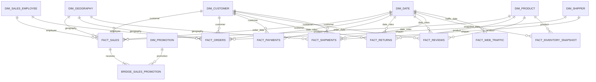

# Mô hình Star Schema Snowflake cho Student Sales

Mô hình được triển khai trong `STUDENT_SALES_DW.CORE`. Đây là fact constellation: tám fact dùng chung bảy conformed dimensions, trong đó `FACT_SALES` là fact trung tâm ở mức dòng đơn hàng. `BRIDGE_SALES_PROMOTION` xử lý quan hệ nhiều-nhiều giữa dòng bán hàng và khuyến mãi.

## Cơ sở thiết kế

- ERD nguồn mô tả các chủ thể địa lý, khách hàng, đơn hàng, thanh toán, nhân viên, sản phẩm, khuyến mãi, trả hàng, đánh giá, tồn kho, vận chuyển, shipper và web traffic.
- Silver canonical có đúng một bản ghi hiện hành cho mỗi khóa tự nhiên của customer, product, promotion, geography, sales employee và shipper. Không có lịch sử hiệu lực đáng tin cậy, nên sáu business dimensions dùng Type 1 trong quy trình full refresh.
- Các dimension không tham chiếu dimension khác. Ngày đăng ký, ngày hiệu lực khuyến mãi và ngày gia nhập shipper được giữ như thuộc tính của dimension; chỉ các fact dùng role-playing keys tới `DIM_DATE`.
- `order_items` có 32 dòng thuộc các cặp `(order_id, product_id)` bị lặp. Vì nguồn không có `order_item_id`, return và review không được gán tùy tiện vào một `SALES_KEY`; chúng giữ `order_id` dạng degenerate key và kết nối tới customer/product/date dimensions.
- Có 276.522 liên kết khuyến mãi trong nguồn, trong đó 206 dòng có khuyến mãi thứ hai. Bridge tạo một dòng `NO_PROMO` cho mỗi sales line không có khuyến mãi và dùng `ALLOCATION_WEIGHT` để tổng doanh thu theo promotion không bị nhân đôi.

## Grain

| Bảng | Grain |
| --- | --- |
| `fact_sales` | Một dòng nguồn trong `order_items`, định danh bởi `order_id + source_row_number` |
| `bridge_sales_promotion` | Một promotion sequence trên một sales line |
| `fact_orders` | Một đơn hàng |
| `fact_payments` | Một thanh toán cho một đơn hàng |
| `fact_returns` | Một sự kiện trả hàng |
| `fact_reviews` | Một đánh giá sản phẩm trong đơn hàng |
| `fact_shipments` | Một lần giao cho một đơn hàng |
| `fact_inventory_snapshot` | Một sản phẩm tại một ngày snapshot |
| `fact_web_traffic` | Một nguồn traffic tại một ngày |

## Sơ đồ quan hệ

## Quy tắc mô hình

- Surrogate key `0` là unknown/not-applicable member.
- `FACT_SALES` lưu các measure cộng được ở grain dòng bán hàng: gross sales, discount, net sales, COGS và gross profit.
- `FACT_ORDERS` là accumulating/aggregate fact ở grain đơn hàng, dùng cho dashboard tránh phải ghép nhiều fact chi tiết.
- Mọi fact giữ `SOURCE_BATCH_ID`, `SOURCE_RECORD_HASH` và `ETL_LOADED_AT_UTC` để truy vết; bridge giữ batch và load timestamp.
- PK, FK và UNIQUE trên standard tables là metadata. Quality gate kiểm tra grain, quan hệ và đối soát sau khi nạp.
- `epd`, `eprom` và `tf` là nguồn biến thể, chưa hợp nhất vào Gold để tránh nhân đôi dữ liệu canonical.
